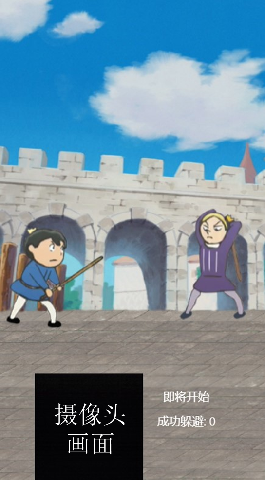
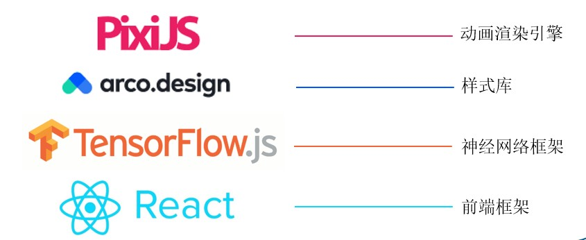
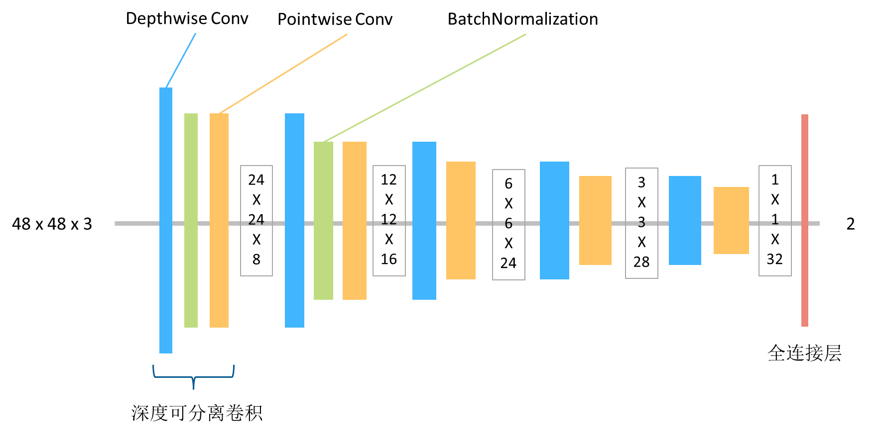
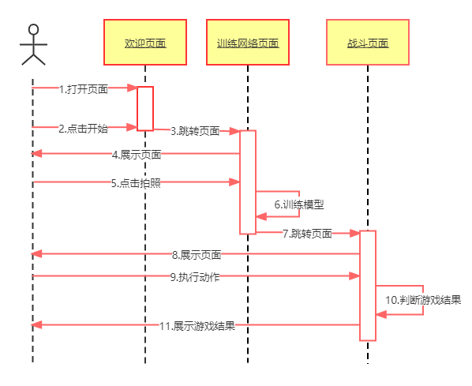
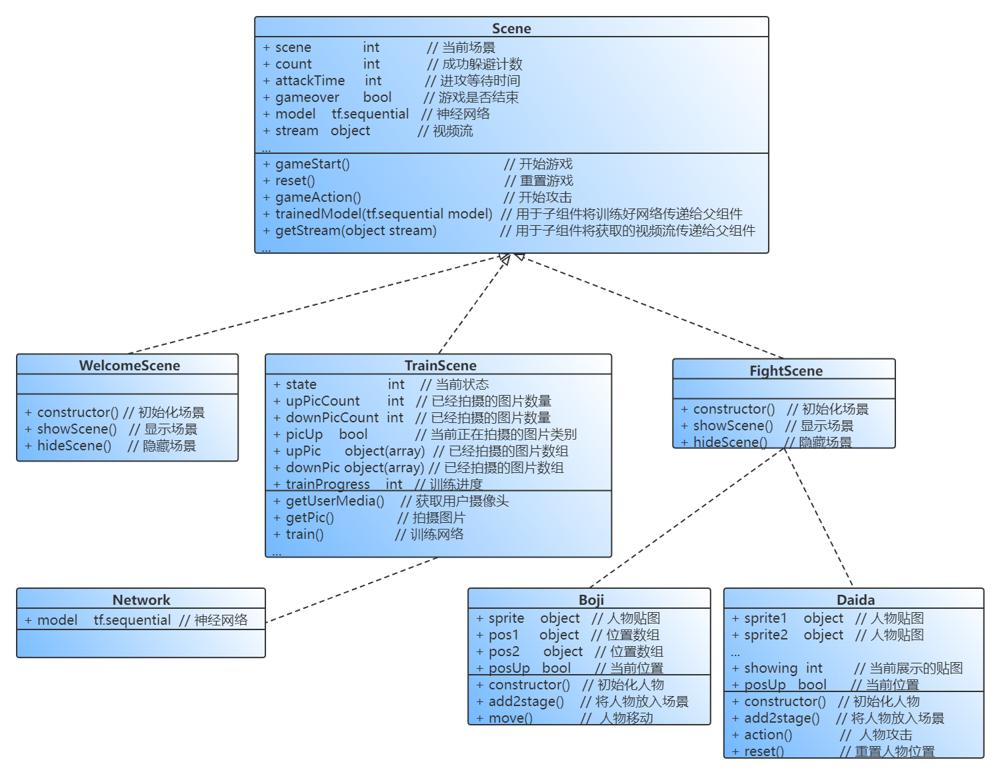

# 国王排名
> 【字节镜像计划】【前端-高级】 [酷玩] 广告-AR互动の进阶

# 玩法
通过摄像头捕捉用户动作，通过用户动作控制波吉躲避戴达的攻击

+ 点击 ▷ 开始游戏
+ 自定义控制波吉**向上**移动的动作，并点击按钮拍摄10张照片
+ 自定义控制波吉**向下**移动的动作，并点击按钮拍摄10张照片
+ 等待神经网络训练完成，点击开始游戏
+ 做出刚才设置的动作，控制波吉上下移动，躲避戴达的攻击

# 运行
```bash
serve -s build
```


# 游戏画面




# 技术细节

## 技术栈


## 网络结构



## 时序图


## 类图
